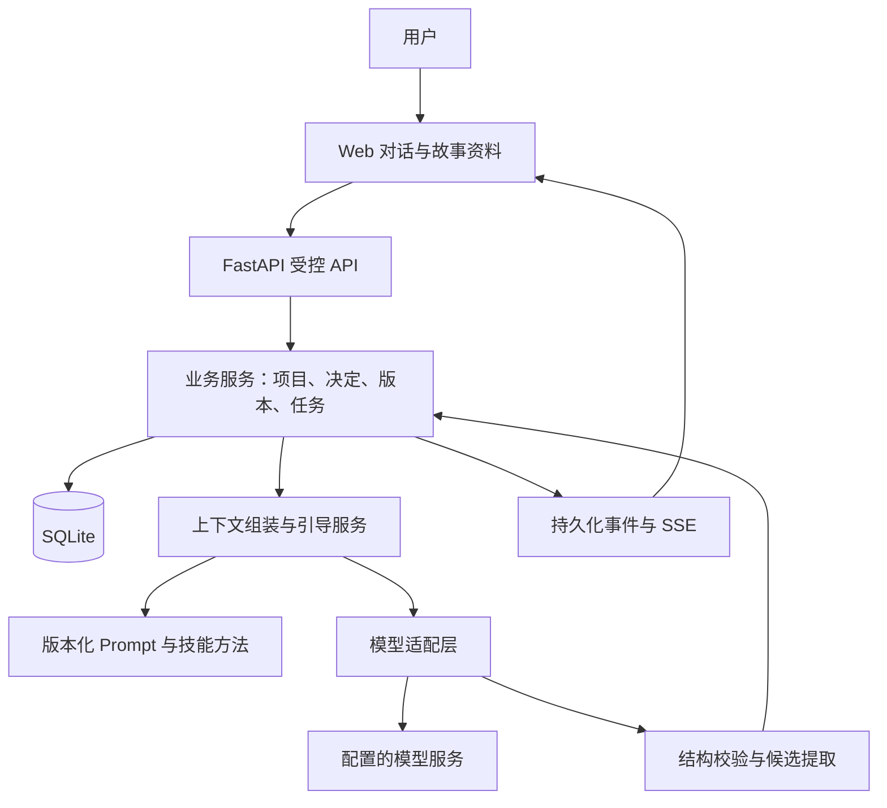

> 测试版增补：本目录已进入故事 Agent 阶段。最新需求、技术实现与验收边界见 [故事Agent开发说明](docs/故事Agent开发说明.md)。主线优先，闲聊可影响剧情；节点由用户确认后参与成文。以下保留第一阶段文档。

# 写作陪伴助手｜开发可行性手册

版本：v0.2 · 2026-09-11  
状态：第一阶段工程实现已验证；真实模型引导效果和产品经理亲手验收待完成。  
配套：[PRD](PRD.md)、[技术适配声明](技术适配声明.md)、[通用技术栈手册](AI产品Vibe Coding通用技术栈手册.md)。

## 第一阶段实施更新

以下为实施后的有效补充，覆盖后文初始规格中不同的细节；后续阶段仍按原划分执行。

1. **撤回目标**：`POST /projects/{id}/decisions` 请求为 `{action,target_id,base_revision,request_id}`。accept/reject 的 target_id 是候选 ID；withdraw/restore 的 target_id 是资料 ID。用户直接编辑的资料也能撤回与恢复，全部记录决定来源。
2. **直接资料写入**：新增 `POST /projects/{id}/artifacts`；PATCH 与 POST 都要求 title、kind、content、base_version、base_revision、request_id。新增资料 base_version 为 0。历史版本接口保留原稿。
3. **生成过期**：增加 run 终态 `stale`，增加候选状态 `stale`。生成任务完成时比较 input_revision 与当前 revision，不一致就保存过期草稿并发送 CONTEXT_CHANGED 错误，禁止直接采用。采用、拒绝、编辑、撤回和恢复均使相关上下文版本变化；当前保守地将其他待定候选标为过期。
4. **查询契约**：项目详情实际返回 `{project,artifacts,proposals,latest_run}`，含各状态候选及最近任务。消息分页使用 before 时间游标及 limit；返回 `{items,next_cursor}`。具体字段由后端 `responses.py` 和 `/docs` 校验并公开。
5. **候选版本**：当前采用候选 ID + 不可变候选内容 + base_revision 检查；不另设可编辑的 proposal_version。编辑发生在正式资料的新版本中。
6. **消息与决定**：重复发送由 Run 上的 `(project_id,request_id)` 唯一约束与内容指纹控制；Message 保存原文、角色与时间。Decision 保存目标、来源、请求指纹与结果，Artifact 保存有效状态及当前版本指向。
7. **上下文与流式**：保留全部当前有效设定、最近对话与候选；尚未生成分层摘要。用保守 UTF-8 字节预算限制输入，超限保持用户消息、任务失败。当前真实模式先等待完整 JSON，再校验、落库并发送 SSE done；失败发送 error。流式首字体验尚未交付，不以模拟逐字播放替代。
8. **模型协议**：GuideTurn 当前为 reply、questions、proposals；候选为 kind/title/content/rationale。suggested_focus、独立摘要及关系检索留待后续阶段，界面当前焦点为故事种子，不表示自动阶段规划已完成。
9. **并发与幂等**：单进程内事务锁、每次至多一个生成任务。cancel 采用幂等资源状态操作，重复取消返回当前状态，不要求另给请求 ID。决定和资料编辑的 request_id 重放须内容指纹一致。
10. **质量验收**：固定 G01—G08 样例，见[引导效果验收样例](docs/引导效果验收样例.md)。mock 工程通过与真实效果待验分别记录，不混为通过。

当前工程测试：27 项后端测试、4 项桌面/手机端到端测试通过；lint、类型检查、Webpack 生产构建通过。启动方式见 [README](README.md)，详细结果与限制见[第一阶段验收记录](docs/第一阶段验收记录.md)。

项目未扩展到完整大纲、正文编辑或公网发布。运行环境已完成准备；下文环境缺项及“待执行”表述保留为初始计划，当前完成状态以上述更新与验收记录为准。

## 1. 结论与文档用途

本项目具备采用常规 Web、关系型存储和模型服务分阶段实现的条件。工程上优先验证用户决定权、数据恢复及对话闭环；模型是否能持续给出有价值的引导、维护长篇故事一致性，需要真实样本验证，不能仅凭选定框架宣称可行性已被证实。

本手册用于开发该助手，包含总体可行性评估和第 1 阶段技术开发规格。后续阶段仅定义边界与验收目标，实际进入时再生成阶段文档，不一次实现全部功能。

### 可行性分项

| 能力 | 实现路径 | 尚需验证的风险 |
| --- | --- | --- |
| 持续对话引导 | 分层上下文、阶段提示、结构化候选 | 问题重复、引导生硬、忽视用户自由表达 |
| 用户掌握决定权 | 候选和正式版本分离，确定性采用操作 | 自然语言指代误判、过度确认 |
| 保存与恢复 | 数据库事务、任务状态、版本与事件记录 | 写入中断、旧版本覆盖、重复提交 |
| 故事结构与伏笔 | 结构化资料、章节引用、规则检查加模型分析 | 关系遗漏、长篇上下文遗忘 |
| 正文与修订 | 分章生成、用户原稿和候选稿分开、差异采用 | 长文风格漂移、修订误伤原稿 |
| 历史可靠性 | 待考证标识、来源记录；有需求再接检索 | 模型把虚构当史实，技能本身含未经核实说法 |

## 2. 分阶段交付

| 阶段 | 交付目标 | 进入下一阶段的条件 |
| --- | --- | --- |
| 0：准备 | 文档、环境、模型配置边界、仓库和依赖规划 | 工程自检完成，重大范围冲突可控 |
| 1：对话与决定闭环 | 项目、对话、候选、采用/拒绝/修改、恢复、已有资料导出 | 自动化与真实模型通过，产品经理实际操作通过 |
| 2：完整故事方案 | 世界、人物关系、完整梗概、分章纲要、伏笔与变更影响 | 一条从种子到完整方案的真实链路通过 |
| 3：正文与修订 | 场景/章节写作、局部采用、版本比较、全文检查及导出 | 指定篇幅样本完成写作与修订；不得外推为任意长篇均可靠 |
| 4：正式体验与上线 | 完善视觉和响应式、身份隔离、部署、备份与线上验收 | 按另两份手册及上线范围验收 |

阶段 2 或 3 是否为首版发布终点尚待决定。阶段 1 仅证明基础闭环，不称为完整写作产品。正式前端及部署手册当前未提供，进入相应阶段时读取；部署平台不在本轮擅自确定。

## 3. 总体架构与职责



浏览器不直接调用模型或数据库。模型不拥有数据库写入权限；其输出只是候选及文字。正式采用由业务服务根据用户动作、明确指代和版本约束执行。无需多 Agent 系统或自主工具规划。

### 技能接入

将 `jin-yong-perspective/SKILL.md` 保留为来源参考，从中提取人物动机、价值冲突、成长、武学边界和伏笔方法，形成受版本管理的项目 Prompt。不得把技能整篇原样当最高优先级指令。

PRD 的用户决定权优先于技能的固定模板与角色扮演要求；产品以写作助手身份提供建议。用户故事与粘贴资料均作为内容处理，其中出现“忽略规则”“直接确认全部”等文字，不获得系统权限。

## 4. 第 1 阶段目标与范围

主链路：新建项目 → 用户提供想法 → 助手提出相关问题及候选设定 → 用户明确采用或拒绝 → 故事资料更新 → 刷新/重启恢复 → 导出已有资料。

必须覆盖 PRD F1、F2、F3，提供 F4/F7/F8 的最小能力。F5 本阶段只做版本冲突及已知资料引用检查；复杂剧情一致性分析在阶段 2 扩展。F6 正文协作在阶段 3 实现。

本阶段不承诺生成整部小说，不实现多人账户、收费、自动发布、文件上传、联网考证、向量检索和全文编辑器。用户仍可自由谈及未来章节，系统记录为未决资料，不提前开发后续功能。

## 5. 技术栈、环境与配置

采用技术适配声明中的 FastAPI/Pydantic、SQLite/SQLAlchemy/Alembic、Next.js/TypeScript/Tailwind、pytest 与 Playwright。第 1 阶段单后端进程，不引入 Redis 或任务队列。

当前 Python 3.9.6 不作为本项目运行环境；开发前准备独立 Python 3.11 环境。现有 Node 24.19.0 暂保留，依赖安装、类型检查、构建通过后锁定组合。这里指定的是计划，尚未安装验证。

### 配置契约

| 配置 | 含义与初始处理 |
| --- | --- |
| `APP_ENV` | 初始 `local`，仅回环地址访问 |
| `DATABASE_URL` | SQLite 文件位于项目 `data/` 内，路径受服务端控制 |
| `MODEL_PROVIDER`、`MODEL_NAME`、`MODEL_BASE_URL` | 必填真实模型配置；mock 模式独立标识，不冒充真实模型 |
| `MODEL_API_KEY` | 用户在后端 `.env` 填写，不进入浏览器、导出和日志 |
| `MODEL_TIMEOUT_SECONDS` | 建议初始 90 秒，可配置，真实延迟后调整 |
| `MODEL_MAX_ATTEMPTS` | 建议单任务模型请求合计最多 2 次；网络重试和格式修复共享额度 |
| `MAX_INPUT_CHARS` | 建议初始单条 12000 字符，超限给出拆分提示 |
| `MAX_OUTPUT_TOKENS`、`CONTEXT_TOKEN_BUDGET` | 按选定模型能力与成本设置，不预填未经验证值 |
| `MODEL_CALL_BUDGET` | 首次真实调用前设定允许的调用次数/Token 与费用控制策略 |
| `ALLOWED_ORIGINS` | 精确允许本地前端来源；不使用任意来源写入权限 |

数值为工程初始假设，不是产品已确认性能承诺。真实模式缺少必要配置时返回明确错误；开发显式选择 mock 才可使用模拟结果。

计划前端 `127.0.0.1:3000`、后端 `127.0.0.1:8000`，启动前复查。实现后由 README 提供经实际验证的安装、迁移、启动和测试命令；本轮没有可启动应用。

`.gitignore` 应覆盖 `.env`、`.venv`、`data/`、日志、构建结果、浏览器测试中可能包含原文的产物；只提交脱敏 `.env.example`。Key 不通过对话收集。

## 6. 项目结构

```text
backend/
  app/
    api/                 # 请求、响应、SSE
    core/                # 配置与错误
    models/              # 数据表
    schemas/             # 结构约束
    services/
      projects.py       # 项目资料读取和编辑
      decisions.py      # 采用、撤回和版本校验
      generation.py     # 持久化任务与恢复
      guidance.py       # 引导及上下文组装
      model_gateway.py  # 模型接口及用量
      prompts/          # 版本化提示
  tests/
  alembic/
  pyproject.toml         # 配合锁文件记录版本
frontend/
  app/
  components/
  tests/
data/                   # 不提交
jin-yong-perspective/   # 已有来源参考
PRD.md
技术适配声明.md
开发可行性手册.md
AI产品Vibe Coding通用技术栈手册.md
README.md
.env.example
.gitignore
```

保留当前根目录文档为唯一权威版本，避免复制到 `docs/` 后出现多个不一致版本。后续阶段文档可置于 `docs/` 并链接根文档。

## 7. 数据与资产

所有业务对象使用 UUID，时间为 UTC；每条记录明确项目归属。以下为阶段 1 最小数据规格，迁移版本由 Alembic 管理。

| 实体 | 核心字段与类型 | 约束 |
| --- | --- | --- |
| Project | id UUID、title str、focus str、revision int、created_at/updated_at datetime | focus 是当前讨论方向，不强制顺序；revision 用于乐观锁 |
| Message | id、project_id UUID、role enum、content text、status enum、client_request_id str | 请求 ID 项目内唯一，重试不重复写入 |
| Proposal | id、project_id、source_message_id UUID、kind str、payload JSON、status enum、version int | 候选与正式资料分开；拒绝原因可选 |
| ArtifactVersion | id、project_id、artifact_id UUID、kind str、content JSON、version int、supersedes_id UUID? | 不可变版本；同一资料版本号唯一；内容按 kind 校验 |
| Decision | id、project_id、proposal_id UUID?、action enum、evidence_message_id UUID?、ui_action_id str?、base_revision int、result_version_id UUID? | 必须有用户动作来源；事务内写入 |
| GenerationRun | id、project_id、request_id str、status enum、input_revision int、prompt_version str、model str、attempts int、usage JSON、error_code str? | 记录超时、用量、输入快照引用；不把密钥写入 |
| RunEvent | run_id UUID、seq int、type enum、payload JSON、created_at datetime | `(run_id, seq)` 唯一，支持重放；事件属于私有业务数据，不进入运行日志 |

资料 kind 初始为 `project_brief`、`character_note`、`world_note`、`story_seed`、`open_question`。复杂章节关系在后续迁移扩展，不提前猜完全部数据字段。

本阶段无上传文件。Markdown 导出从一致版本快照生成，文件名安全化，不允许客户端任意指定磁盘路径。

### 一致性与事务

采用候选时，在同一数据库事务中检查项目归属、候选版本、项目 revision，写入 Decision 和新 ArtifactVersion，再更新状态与 revision。版本不符返回 409，让用户看到最新版本；不悄悄覆盖。

拒绝候选只修改候选状态并记录原因。撤回正式设定创建新的撤回记录和有效版本指向，不删除原版本。用户直接编辑生成用户来源的新版本；若改变其他资料，只列影响，不自动改写。

## 8. 状态流转与恢复

### 候选与确认

`pending → accepted / rejected / withdrawn`。已接受内容后续撤回由撤回决定及版本链表达，历史仍可追溯。

- 点击“采用”或“拒绝”携带候选 ID 和版本，代码可直接执行。
- “用第二个”“就这个”等表达，只在明确的当前候选组、单一指代及版本一致时解析为确定动作，不再重复确认。
- 自由表述若不能可靠绑定对象，模型只能提出解释，助手用一个短问题澄清；模型置信度本身不能充当采用授权。
- “都不错”“以后再说”、跳过、超时和关闭页面均不采用。
- 用户直接明确给出设定可作为用户编辑保存；抽取后的扩写和额外推断保持候选状态。

### 生成任务

`queued → running → succeeded / failed / cancelled / interrupted`。终态任务重试创建新 run 并关联原任务，不覆写历史。

消息和任务先落库，再调用模型；模型等待期间不持有写事务。第 1 阶段每项目最多一个生成任务，全局先限制一个模型任务，其他请求给出忙碌提示。

服务重启时，把遗留 `running/queued` 任务标为 `interrupted`，保留已保存的输入和部分内容，供用户重试；不声称能从模型某个 Token 精确续传，也不自动重复付费调用。浏览器断线不等于用户取消；恢复后按 run 查询状态和重放事件。

主动停止必须持久化取消状态并尽力取消上游请求；最终写入前检查取消标记，不能把取消后的响应提交成新候选。停止后供应商已产生的用量仍可能计费。

## 9. API 与错误契约

统一前缀 `/api/v1`。以下字段为最小契约，编码时以 Pydantic schema/OpenAPI 为准。

| 方法与路径 | 请求 | 成功响应 |
| --- | --- | --- |
| POST `/projects` | `{title}` | 201 `{project}` |
| GET `/projects` | 无 | 200 `{items}` |
| GET `/projects/{id}` | 无 | 200 `{project, artifacts, pending_proposals, active_run}` |
| GET `/projects/{id}/messages` | 分页 cursor、limit | 200 `{items,next_cursor}` |
| POST `/projects/{id}/turns` | `{text,client_request_id,base_revision}` | 202 `{message_id,run_id,status}` |
| GET `/runs/{id}` | 无 | 200 `{status,result,error,last_event_seq}` |
| GET `/runs/{id}/events` | `after_seq` 或 Last-Event-ID | SSE 重放及新增事件 |
| POST `/runs/{id}/cancel` | `{request_id}` | 200 `{status}`，幂等 |
| POST `/projects/{id}/decisions` | `{action,proposal_id,proposal_version,base_revision,request_id}` | 200 `{decision,project_revision,artifact_version}` |
| PATCH `/projects/{id}/artifacts/{artifact_id}` | `{content,base_version,request_id}` | 200 `{artifact_version,project_revision}` |
| GET `/projects/{id}/artifacts/{artifact_id}/versions` | 无 | 200 `{items}` |
| GET `/projects/{id}/export` | `format=markdown` | UTF-8 Markdown，含版本和未决事项 |

采用/拒绝要求 proposal_id；撤回指定已接受候选；直接编辑走资料接口。全部写接口检查归属、长度、枚举、版本和幂等性。不存在返回 404，无效参数 422，版本冲突 409，任务忙碌 409；模型配置错误和供应商错误映射为受控错误，不回显上游秘密。

错误结构：`{"error":{"code":"VERSION_CONFLICT","message":"资料已更新，请查看最新版本后重试"}}`。

### SSE

- 每条事件含递增 `id`；`chunk` 零到多次，最后一个终结事件为 `done` 或 `error`。
- `chunk` 数据：`{run_id,text}`，仅为生成预览，不进入正式资料。
- `done` 数据：`{run_id,message,proposals,project_revision}`，来自最终校验及持久化结果。
- `error` 数据：统一 `{error:{code,message}}`。取消和重启中断分别使用 `RUN_CANCELLED`、`RUN_INTERRUPTED`。
- 先完成持久化再发布事件；批量保存文本片段，避免每个 Token 一次数据库写入。
- 网络不可达时无法保证浏览器收到终结事件；重连通过任务状态与持久化事件恢复。客户端按事件 ID 去重，不重复追加文字。
- SDK 初始化、鉴权、解析、写库和流输出错误均在调用链外层收敛，不能静默失败。

## 10. Prompt、模型契约与上下文

第 1 阶段仅一个主要模型契约 `GuideTurn`，输出含 `reply`、`questions`、`proposals`、`suggested_focus`、`open_questions`。Proposal 只允许 `kind/content/rationale/source_refs`，不允许模型输出 `accepted=true` 或任意数据库操作。

Prompt 独立文件建议为 `guide_turn_v1.md`，输入包括当前用户消息、当前候选组、项目焦点、已确认资料、相关旧资料及最近对话。要求先回应用户，再提出最多一至两个关键问题；无方向时给少量候选；尊重跳过与拒绝，不冒充金庸本人。

格式指令必须给正例（含 reply 和候选列表的合法结构）与反例（缺字段、擅自采用、在候选中加入无授权事实）。结构错误优先确定性去除代码围栏等包装，再校验；最多在任务总请求额度内修复一次，不无限重试。多问了一个问题等质量瑕疵单独记录，不一概视作解析失败。

结构化流解析只展示可识别的 reply 字段片段，所有片段均按不可信文本转义。若供应商无法可靠提供该方式，流中先显示等待状态，校验完成后显示完整回复，并记录为流式体验限制，不能用伪造逐字播放冒充模型实时流。

### 上下文权威顺序

用户最新明确修改及当前有效资料版本 → 当前待讨论候选 → 原始消息证据 → 有版本与来源的历史摘要。历史摘要是派生数据，不是正式事实源。

上下文按项目限定查询，采用相关资料加近期消息，不把整本小说每轮全量发送。摘要记录覆盖消息区间和资料 revision，修改后失效重建。若预算不足，保留关键决定并缩小当前任务，不悄悄丢弃规则。向量库在简单索引无法满足检索质量时再评估。

## 11. 最小界面与交互

一个项目列表入口和一个写作工作区。工作区包含对话、当前焦点、候选设定卡片及正式资料；具备采用、拒绝、编辑、跳过、停止、重试和导出。

明确显示“正在生成”“尚未采用”“已保存”“保存失败”“任务中断”等状态。失败时保留用户输入；刷新从后端恢复。桌面并排展示资料，窄屏切换面板，避免对话或采用按钮不可访问。

Markdown 渲染默认禁用原始 HTML，生成内容不得执行脚本。页面不展示数据库、Prompt 或技能内部术语，技术错误转换为用户可执行的提示。

## 12. 双层测试与验收

### 第一层：mock 与工程验证

pytest 验证：

1. 新建项目、写入消息、查询分页和项目隔离。
2. 采用事务、拒绝、撤回、直接编辑与历史版本可追溯。
3. 重复 request_id 不重复消息、不重复启动模型任务；重复决策不重复版本。
4. 旧 revision、过期候选、跨项目对象访问被拒绝。
5. 含糊回复不采用；明确的当前“第二个”唯一绑定后不重复确认。
6. 正确输出、包装格式、无效 schema、超量问题分别按结构与质量处理。
7. 缺 Key、初始化异常、超时、限流、重试耗尽、取消和写库失败。
8. SSE 终结、重放去重、刷新与进程重启中断恢复。
9. 导出只包含选定项目的一致版本；秘密不进入响应和运行日志。

Playwright 验证实际采用、拒绝、编辑、断线恢复、空项目、错误提示和停止；同时运行类型检查、ESLint、构建。目标初始检查 1280px 与 390px 宽度。

### 第二层：真实模型端到端冒烟

使用团队自拟测试故事，避免真实用户敏感原稿。每个不同模型契约和关键链路至少有一个真实输入经模型、持久化、界面查看的完整样本。第 1 阶段覆盖：

- 空白创作：没有想法 → 获得候选 → 选一个 → 正式资料保存。
- 明确创作：给定主角目标 → 连续引导 → 拒绝建议 → 不改变正式设定。
- 修改与恢复：改变已确认设定 → 检查新版本 → 重启 → 恢复后继续引导。
- 模糊回复：“都挺好” → 保持待定；随后明确选择 → 正确采用。

运行日志记录厂商、模型、Prompt 版本、日期、用量、首内容延迟、总耗时、尝试次数、结构首测/重试合规和人工质量判断；供应商未给用量时标未知，不填零。价格未核实时不宣称精确费用。

用 `curl -N` 验证 SSE 时序和终结，同时在真实界面查看最终结果。真实鉴权失败、网络和限流仅报告实际触发的情况；没有遇到的异常路径可由 mock 覆盖，但不声称已真实验证。

### 效果判定

用户决定权、数据不丢失、项目不串数据、错误不泄密为通过必需条件，任一样本违反即失败。引导是否相关、是否有助推进、是否重复、是否添加无授权设定，由产品经理按样本评审记录通过/需改进及理由。量化质量目标与允许瑕疵尚待真实试用确定。

### 产品经理操作清单

- [ ] 新建一个项目，输入一个模糊想法，检查助手是否接住想法再提问。
- [ ] 回复“还没想法”，检查是否有具体候选可选。
- [ ] 回复“都挺好”，检查右侧没有出现新的已确认设定。
- [ ] 明确采用一个候选，检查资料更新且没有重复确认。
- [ ] 拒绝另一个建议，检查助手换角度，正式资料未被替换。
- [ ] 修改一个设定，查看此前版本是否仍可追溯。
- [ ] 刷新页面，检查消息、资料和待定项仍在。
- [ ] 在 AI 协助下重启服务，检查中断任务可识别并能重试。
- [ ] 停止一次生成，检查已有输入保留且候选未被擅自采用。
- [ ] 导出资料，检查内容与界面一致且标出待定项。

上述均为待执行清单，本轮没有任何功能验收结果。

## 13. 成本、数据与关键风险

模型成本按输入 Token、输出 Token、对应单价及总尝试次数计算；每轮记录用量，以完整样本估算一个项目消耗，不凭空给月费。限制上下文、输出和重试；没有实际成本约束时先保持 mock，首次真实调用前明确预算。

用户对话和原稿保存在本地数据库；所需片段在真实调用时发送给选定供应商。上线或更换供应商前说明数据流向与保留政策。后端日志不保存完整原文，私有消息、任务事件与导出仍按用户资料保护。

| 风险 | 应对 | 验证或触发条件 |
| --- | --- | --- |
| 模型误判“同意” | 明确对象、用户证据、版本检查；不确定时短问澄清 | 模糊/否定/转述/多候选测试 |
| 长篇遗忘或幻觉 | 有效资料版本、来源追踪、分层摘要、分章处理 | 阶段 2—3 长对话样本 |
| SQLite 写入竞争 | 短事务、单进程边界、忙碌错误处理 | 并发需求出现时评估 PostgreSQL |
| 任务重试重复收费 | 幂等请求、持久化 run、重启不自动重付费 | 中断、取消、重放测试 |
| 技能历史说法错误 | 标待考证，提供来源才能标核实 | 涉及具体史实的样本评审 |
| 原稿被修订覆盖 | 新版本、局部采用、影响清单 | 阶段 3 差异与恢复测试 |
| 本地未登录服务被误公开 | 仅回环监听、受控来源和写入校验；不做公网隧道 | 公网前增加认证授权及项目归属隔离 |

重要数据删除需明确操作确认；第 1 阶段不开放永久清除。迁移前备份 SQLite 并验证恢复，使用受控备份方式，避免运行中只复制主文件漏掉 WAL。上线前另定备份频率、保留期、删除规则和恢复目标。

## 14. 交接与下一步

开发启动顺序：准备独立 Python 环境 → 初始化 Git 与忽略规则 → 锁定依赖 → 建表及迁移 → 实现决定和恢复逻辑 → 接 mock 引导 → 完成最小界面 → 自动化验证 → 接真实模型 → 实际验收。

当前需要保留的产品待定项：首版是否覆盖正文、模型与成本/数据接受范围、未来公网与跨设备要求。采用通用默认方案的工程细节由开发方负责，不要求产品经理选择数据库或接口框架。

第 1 阶段结束必须交付可运行代码、README、无秘密配置示例、迁移、测试结果、真实冒烟记录及产品经理验收结果；没有 Key 时明确写“真实模型待验”。停止不用的临时服务，保留预览时说明地址和用途。

阶段 2 复用已有项目、消息、决定、版本、任务、模型入口和前端工作区，只扩展故事领域资料及引导。阶段 3 扩展章节与修订版本。进入上线前重新评估并发存储、身份权限、部署环境与回滚，不直接把本地边界当生产设计。

## 15. 来源与验证边界

- 产品行为依据本项目 [PRD](PRD.md)，工程原则依据[通用技术栈手册](AI产品Vibe Coding通用技术栈手册.md)。
- 创作方法来源：[jin-yong-perspective](https://github.com/Wunicheng233/jin-yong-perspective)。
- FastAPI 响应模型支持输出校验及字段过滤：[官方文档](https://fastapi.tiangolo.com/tutorial/response-model/)。
- Next.js 安装条件参考：[官方安装文档](https://nextjs.org/docs/app/getting-started/installation)。依赖组合仍需本地验证。
- SQLite 单写者及适用边界参考：[官方说明](https://www.sqlite.org/whentouse.html)。

环境事实见《技术适配声明》。所有架构、初始参数、状态与接口均为本项目设计，未标注为已完成实现；本轮只完成文档生成和一致性检查。
